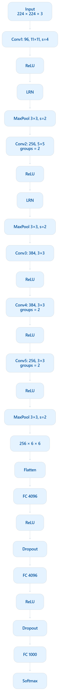

# AlexNet — Paper Reimplementation

## Paper

**Title:** ImageNet Classification with Deep Convolutional Neural Networks

**Authors:** Alex Krizhevsky, Ilya Sutskever, Geoffrey E. Hinton

**Conference:** NeurIPS 2012

**Paper:** [Original AlexNet Paper](https://proceedings.neurips.cc/paper_files/paper/2012/file/c399862d3b9d6b76c8436e924a68c45b-Paper.pdf)

---

## Architecture

AlexNet consists of 8 learned layers:

- 5 Convolutional layers
- 3 Fully Connected layers

The architecture used in the paper is shown below:



Main components used:

- ReLU activation
- Local Response Normalization (LRN)
- Overlapping Max Pooling
- Dropout
- Data Augmentation
- Two-GPU training
- SGD with momentum

---

## Architecture Details

```text
Input: 224 × 224 × 3

Conv1: 96 filters, 11×11, stride 4
ReLU
LRN
MaxPool: 3×3, stride 2

Conv2: 256 filters, 5×5, groups=2
ReLU
LRN
MaxPool: 3×3, stride 2

Conv3: 384 filters, 3×3
ReLU

Conv4: 384 filters, 3×3, groups=2
ReLU

Conv5: 256 filters, 3×3, groups=2
ReLU
MaxPool: 3×3, stride 2

Flatten

FC1: 4096
ReLU
Dropout

FC2: 4096
ReLU
Dropout

FC3: 1000